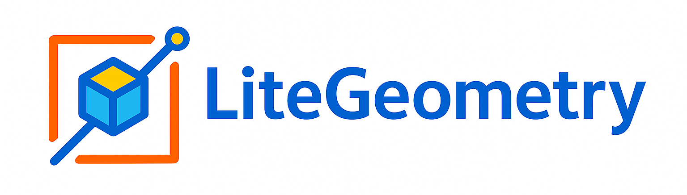

<h1 align="left">
    
</h1>

# **🌟 About The Project**

**LiteGeometry** is a lightweight C++ library — built on top of [Eigen](https://eigen.tuxfamily.org/index.php?title=Main_Page) — that delivers high-performance 2D and 3D computational geometry and path-planning utilities.

  

Whether you're building quick prototypes or deploying models in production, LiteGeometry ensures a fast, reliable, and scalable experience.

# **ℹ️ Why Use LiteGeometry?**

- **Simplicity**: Clean and intuitive API design that makes the library easy to use and integrate.

- **Performance**: Efficient implementations for common geometry and planning tasks.

- **Utility**: A wide selection of common geometric algorithms and advanced path planning techniques.

# **✨ Key Modules**

1. **Core Geometry Utilities**

    Provides fundamental 2D/3D geometry operations, such as:

    - Containment queries for points relative to lines, polygons, and polyhedra.
    - Exact intersection tests between segments and other shapes (lines, polygons, and polyhedra), including precise computation of intersection points.

2. **Advanced Modeling Algorithms**

    Supports advanced modeling tasks, including:

    - Oriented Bounding Box (OBB) construction in both 2D and 3D.
    - Rasterization routines for lines, polygons, and polyhedron surfaces.
    - A pinhole-camera model for projecting 3D points onto a 2D image plane.

3. **Path Planning**

    Specialized algorithms for efficient pathfinding:

    - Two optimized 3D Jump-Point Search (JPS) implementations for large-scale environments.

# **🛠 Development Environment**

This library is actively developed and tested with:

- **Compiler**: MSVC 2022 (C++17 mode)
- **Eigen**: 3.4.90
- **CGAL**: 5.6
- **Boost**: 1.87.0
- **Abseil**: 20240116
> ⚠️ Earlier versions may work but aren't fully validated.

# **📚 Documentation**
Explore the full capabilities of **LiteGeometry** in our comprehensive documentation:

:books: **https://litegeometry.github.io**

# **📜 License**
LiteGeometry software: [BSD-3-Clause License](LICENSE.txt)

